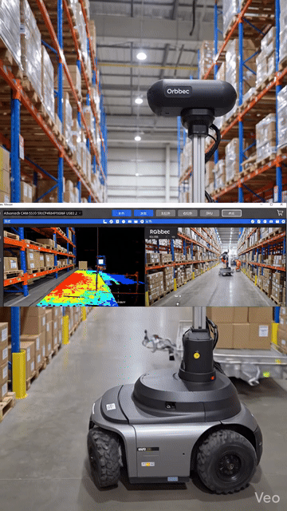
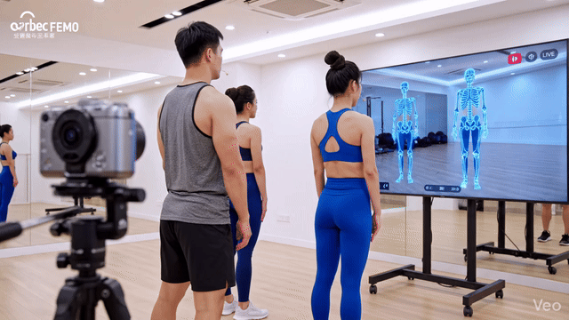
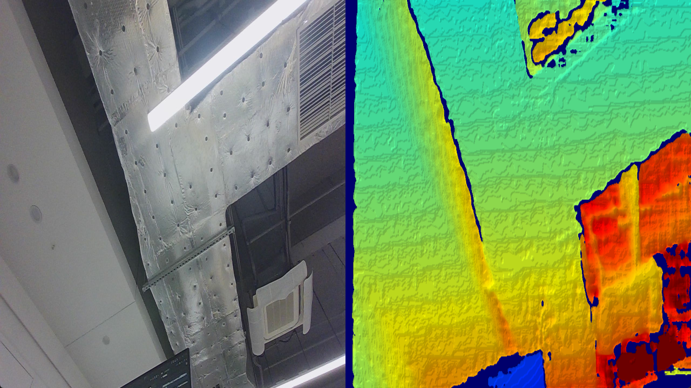

<h1 align="center">
  pyorbbecsdk
  <br>
</h1>

<p align="center">
  Python Bindings for Orbbec SDK v2.x
  <br />
  The official Python wrapper enabling developers to interface with Orbbec RGB-D cameras (Gemini, Femto, Astra series) through a clean, Pythonic API backed by native C++ performance via pybind11.
</p>

<p align="center">
  <a href="https://orbbec.github.io/pyorbbecsdk/index.html">Documentation</a>
  ·
  <a href="https://pypi.org/project/pyorbbecsdk2/">PyPI Package</a>
  ·
  <a href="https://github.com/orbbec/pyorbbecsdk/issues">Community</a>
  ·
  <a href="https://github.com/orbbec/OrbbecSDK_v2">OrbbecSDK v2</a>
  ·
  <a href="https://gitee.com/orbbecdeveloper/pyorbbecsdk">Gitee Mirror</a>
</p>

<p align="center">
  <a href="https://github.com/orbbec/pyorbbecsdk/actions/workflows/build.yaml"></a>
  <a href="https://pypi.org/project/pyorbbecsdk2/"></a>
  <a href="https://www.python.org/"></a>
  <a href="LICENSE"></a>
</p>

---

> **Branch note:** This is the `v2-main` branch (SDK v2.x). For the legacy v1.x branch, see [main](https://github.com/orbbec/pyorbbecsdk/tree/main). The differences between SDK v1.x and v2.x are described in the [OrbbecSDK_v2 README](https://github.com/orbbec/OrbbecSDK_v2).

## Table of Contents

- [Overview](#overview)
- [Supported Devices](#supported-devices)
- [Why pyorbbecsdk?](#why-pyorbbecsdk)
- [Getting started](#getting-started)
- [Samples](#samples)
- [Supported platforms](#supported-platforms)
- [Automated Firmware Update](#automated-firmware-update)
- [FAQ](#faq)
- [Community](#community)
- [Changelog](#changelog)
- [License](#license)

## Overview

<table style="width: 100%; table-layout: fixed;">
  <tr>
    <th style="width: 33.33%; text-align: center;">AMR Grocery Delivery</th>
    <th style="width: 33.33%; text-align: center;">Body Health Tracking</th>
    <th style="width: 33.33%; text-align: center;">3D Face Payment</th>
  </tr>
  <tr>
    <td></td>
    <td></td>
    <td></td>
  </tr>
</table>

## Supported Devices

> **Important:** 
> - Most new devices come with compatible firmware pre-installed and work out-of-the-box.
> - Starting from October 2025 (Orbbec SDK v2.5.5), devices using the OpenNI protocol will be upgraded to UVC protocol. See [the upgrade document](https://github.com/orbbec/OrbbecSDK_v2?tab=readme-ov-file#12-upgrading-from-openni-protocol-to-uvc-protocol) for details.
> - For legacy v1.x device support (Astra+, Astra Pro Plus, Gemini 2 XL), use the [main branch](https://github.com/orbbec/pyorbbecsdk/tree/main).

For detailed branch comparison and device support matrix, see [Introduction - Device Support Comparison](https://orbbec.github.io/pyorbbecsdk/source/1_overview/Introduction.html#device-support-comparison).

## Why pyorbbecsdk?

- 📷 **RGB-D streaming** — Depth, color, and infrared streams with configurable resolution and FPS.
- 🛠️ **Post-processing filters** — Temporal, Spatial (Advanced), HoleFilling, Threshold, Decimation, Noise Removal.
- 🎯 **Depth-color alignment** — Software `AlignFilter` and hardware D2C alignment.
- ☁️ **Point cloud generation** — Colored 3D point clouds via `PointCloudFilter`.
- 📐 **Camera calibration data** — Access intrinsics, distortion coefficients, and extrinsic transforms.
- ⚡ **Real-time performance** — Backed by native C++ performance via pybind11.
- 🌐 **Network cameras** — Connect to Femto Mega / Gemini 2 XL over Ethernet.
- 📦 **Pre-built wheels** — No compilation required for Windows x64, Linux x64, and ARM64.

## Getting started

The pyorbbecsdk contains all the libraries that power your camera along with tools that let you experiment with its features and settings.

To get started:

**1. Install the package** via PyPI (recommended) or from GitHub Release:

```bash
pip install --upgrade pyorbbecsdk2
```

> 💡 **Recommended: Use Virtual Environment**
>
> Modern systems (e.g., macOS, Ubuntu 24.04+) restrict pip installations to the system Python. Using a virtual environment avoids permission errors:
>
> ```bash
> # Create and activate virtual environment
> python3 -m venv orbbec_env
> source orbbec_env/bin/activate  # Linux/macOS
> # .\orbbec_env\Scripts\Activate.ps1  # Windows PowerShell
>
> # Install SDK in virtual environment
> pip install --upgrade pyorbbecsdk2
> ```
> See [Virtual Environment Guide](https://orbbec.github.io/pyorbbecsdk/source/2_installation/virtual_environment_guide.html) for more options (venv, pyenv, conda).

> 🔧 **Building from Source?**
> See the [Build with UV Guide](https://orbbec.github.io/pyorbbecsdk/source/4_Package/build_with_uv.html) for detailed instructions.

> **Note for Linux users:** PyPI does not provide pre-built wheels for Python 3.8 on Linux (x64 and ARM64). If you need Python 3.8 on Linux, download the wheel from [GitHub Releases](https://github.com/orbbec/pyorbbecsdk/releases) or [build from source](https://orbbec.github.io/pyorbbecsdk/source/4_Package/build_with_uv.html).

**2. Setup the environment** (one-time OS-level configuration for metadata and udev rules):

```bash
# From the repository

# Windows (PowerShell — will auto-request Administrator)
python scripts/env_setup/setup_env.py
# Linux (will auto-request sudo)
python3 scripts/env_setup/setup_env.py

# Or from the installed package
python $(python -c "import pyorbbecsdk, os; print(os.path.dirname(pyorbbecsdk.__file__))")/shared/setup_env.py
```

**3. Start experimenting** with the SDK's Quick Start code:

```python
from pyorbbecsdk import *

pipeline = Pipeline()
pipeline.start()                        # uses default config from OrbbecSDKConfig.xml
frames = pipeline.wait_for_frames(1000) # get synchronized Color + Depth frames
```

For full visualisation, check out [`examples/quick_start.py`](examples/quick_start.py). 
**Running result:**



## Samples

The [examples/](examples/) directory contains **35+ scripts** organized by difficulty to start using the pyorbbecsdk with only a few lines of code.

| Level | Category | Description |
|-------|----------|-------------|
| ⭐ | [**Quick Start**](examples/quick_start.py) | Zero-config RGBD viewer — first thing to run. |
| ⭐⭐ | [**Beginner**](examples/beginner/) | Hello camera, depth viz, alignment, calibration, point cloud, multi-stream, IMU, network camera, and firmware update. |
| ⭐⭐⭐ | [**Advanced**](examples/advanced/) | Recording & playback, device control, filter chains, HDR, presets, depth work modes, multi-device sync, coordinate transforms, high-performance pipeline. |
| ⭐⭐⭐⭐ | [**Applications**](examples/applications/) | YOLO object detection with depth overlay; interactive depth ruler. |
| ⭐⭐⭐⭐ | [**LiDAR**](examples/lidar_examples/) | LiDAR streaming, control, recording, and playback. |

See [examples/README.md](examples/README.md) for the full list with per-script descriptions and device compatibility.

**📚 Next Steps**: Explore our structured learning path from beginner to advanced → [Quick Start Guide - Next Steps](https://orbbec.github.io/pyorbbecsdk/source/3_QuickStarts/QuickStart.html#next-steps)

## Supported Platforms

pyorbbecsdk supports the following operating systems and architectures:

- **Windows** 10 or later: x64 architectures
- **Linux x64**: tested on Ubuntu 18.04, 20.04, 22.04 and 24.04
- **Linux ARM64**: tested on NVIDIA Jetson AGX Orin, NVIDIA Jetson Orin NX, NVIDIA Jetson Orin Nano, NVIDIA Jetson AGX Xavier, NVIDIA Jetson Xavier NX, NVIDIA Jetson Thor
- **macOS**: tested on M2 chip, OS version 13.2

**Supported Python versions: 3.8 to 3.13**

### Quick Camera Evaluation

Want to test your camera without writing code? Download **Orbbec Viewer** — a standalone GUI application that lets you immediately view camera streams, adjust settings, and verify device functionality.

*(Click a platform icon below to download Orbbec Viewer for your OS)*

| <div align="center"><a href="https://github.com/orbbec/OrbbecSDK_v2/releases/download/v2.7.6/OrbbecViewer_v2.7.6_202602022045_20730ef_win_x64.zip" title="Download Orbbec Viewer for Windows"></a></div> | <div align="center"><a href="https://github.com/orbbec/OrbbecSDK_v2/releases/download/v2.7.6/OrbbecViewer_v2.7.6_202602021245_20730ef_linux_x86_64.zip" title="Download Orbbec Viewer for Linux x64"></a></div> | <div align="center"><a href="https://github.com/orbbec/OrbbecSDK_v2/releases/download/v2.7.6/OrbbecViewer_v2.7.6_202602021245_20730ef_linux_arm64.zip" title="Download Orbbec Viewer for Linux ARM64"></a></div> | <div align="center"><a href="https://github.com/orbbec/OrbbecSDK_v2/releases/download/v2.7.6/OrbbecViewer_v2.7.6_202602022045_20730ef_macOS_arm64.zip" title="Download Orbbec Viewer for macOS"></a></div> |
| :---: | :---: | :---: | :---: |
| **Windows (x64)** | **Linux (x64)** | **Linux (ARM64)** | **macOS (ARM)** |

## Automated Firmware Update

If you encounter errors related to firmware version mismatch, please use the automated update assistant:

```bash
python scripts/auto_update_firmware.py
```

This script will check your current device firmware version, automatically download the correct firmware, and perform the firmware update safely.

If you prefer to manually download firmware files, they are available at the [OrbbecFirmware](https://github.com/orbbec/OrbbecFirmware) repository.

For detailed device support and firmware compatibility information, see [Introduction — v2-main Branch](https://orbbec.github.io/pyorbbecsdk/source/1_overview/Introduction.html#v2-main-branch).

## FAQ

See the [full FAQ](https://orbbec.github.io/pyorbbecsdk/source/7_FAQ/FAQ.html) for common issues and solutions.

## Community

Join the conversation and connect with other pyorbbecsdk users to share ideas, solve problems, and help make the SDK awesome. 

- **GitHub Issues** If you come across a bug or want to request a feature, please raise an issue in this [**GitHub repository**](https://github.com/orbbec/pyorbbecsdk/issues).
- **Documentation** The comprehensive [Orbbec SDK V2 Python Wrapper User Guide](https://orbbec.github.io/pyorbbecsdk/index.html) covers architecture, API quick-starts, and usage guides.
- **Contributing** Contributions are welcome — read [CONTRIBUTING.md](.github/CONTRIBUTING.md) for build instructions, code style, and the PR process.

## Changelog

See [CHANGELOG.md](docs/CHANGELOG.md) for a detailed history of changes.

## License

This project is licensed under the [Apache License 2.0](LICENSE).
