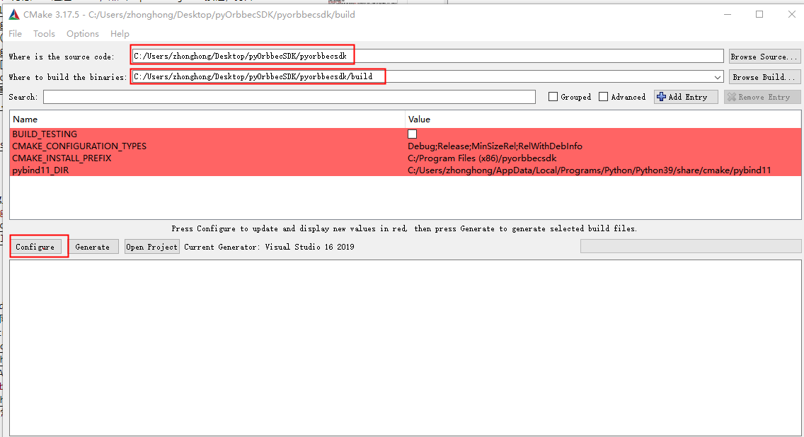
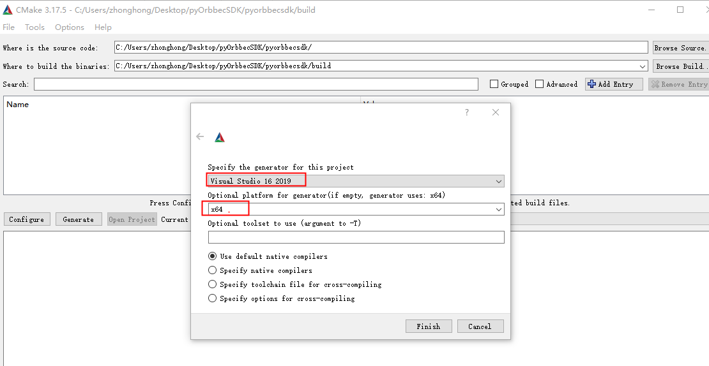
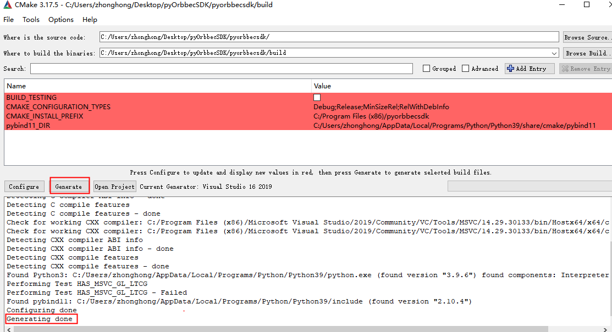
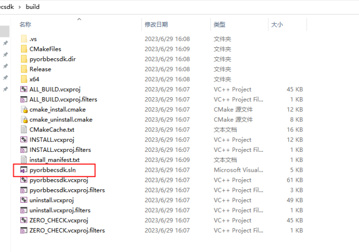
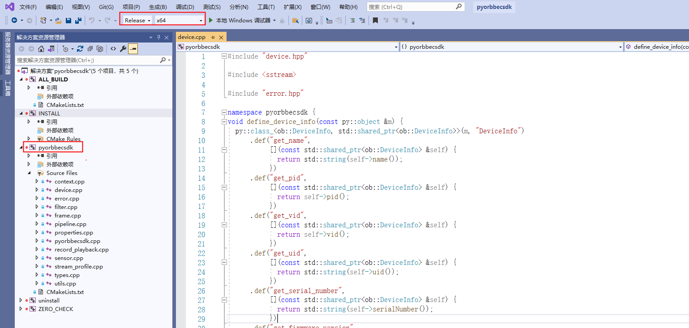
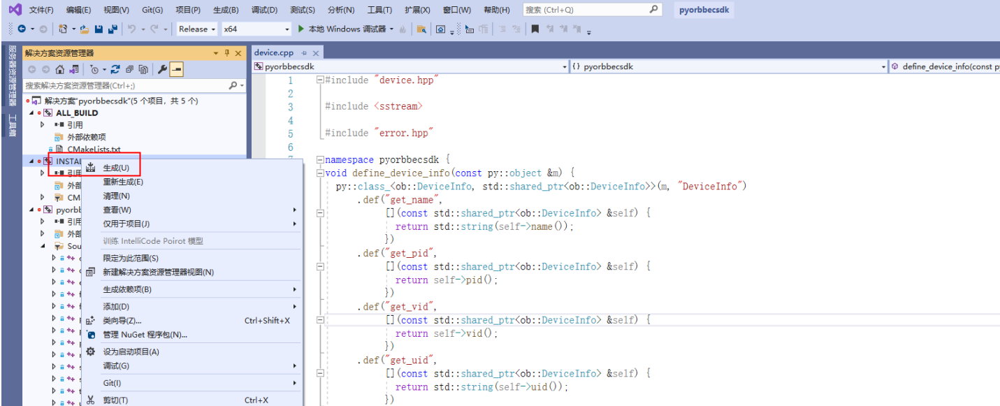
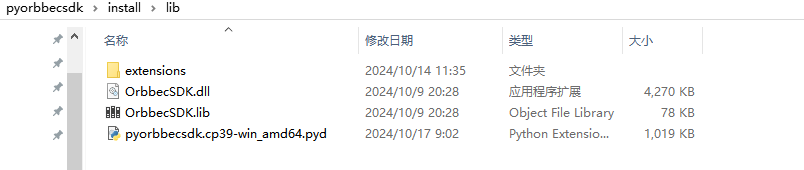
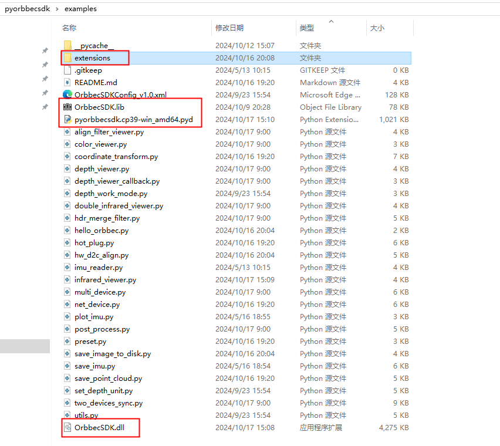

# Orbbec SDK Python Wrapper 文档

## 目录

<!-- TOC -->

- [Orbbec SDK Python Wrapper 文档](#orbbec-sdk-python-wrapper文档)
  - [目录](#目录)
  - [概述](#概述)
  - [系统要求](#系统要求)
    - [操作系統](#操作系統)
    - [编译平台要求](#编译平台要求)
    - [Python 版本](#python-版本)
  - [Python SDK 支持的硬件产品](#python-sdk支持的硬件产品)
  - [Orbbec SDK Python Wrapper Sample 编译说明](#orbbec-sdk-python-wrapper-sample编译说明)
    - [Windows python sdk 编译](#windows-python-sdk-编译)
      - [下载 python sdk 源码](#下载-python-sdk-源码)
      - [安装依赖](#安装依赖)
      - [配置 Visual Studio](#配置visual-studio)
      - [编译 python SDK](#编译python-sdk)
      - [测试 python SDK Sample](#测试python-sdk-sample)
    - [Linux python SDK 编译](#linux-python-sdk-编译)
      - [下载 python sdk 源码](#下载-python-sdk-源码-1)
      - [安装依赖](#安装依赖-1)
      - [Python SDK 编译](#python-sdk-编译)
      - [测试 Sample](#测试-sample)
  - [常用调用流程](#常用调用流程)
    - [视频数据获取](#视频数据获取)
    - [获取设备列表](#获取设备列表)
    - [获取传感器列表](#获取传感器列表)
    - [获取设备信息](#获取设备信息)
    - [彩色相机自动曝光](#彩色相机自动曝光)
    - [获取和设置彩色相机曝光值](#获取和设置彩色相机曝光值)
    - [获取和设置彩色相机增益](#获取和设置彩色相机增益)
    - [彩色相机数据流镜像](#彩色相机数据流镜像)
    - [开关激光](#开关激光)
    - [开关 LDP](#开关ldp)
    - [开关软件滤波](#开关软件滤波)
    - [重启设备](#重启设备)
    - [其他接口](#其他接口)
  - [FAQ](#faq)

<!-- TOC -->

## 概述

本文档主要介绍 Orbbec SDK Python Wrapper 的功能，Orbbec SDK Python Wrapper 基于 Orbbec
SDK 进行设计封装，主要实现数据流接收，设备指令控制。

## 系统要求

### 操作系統

- Windows：Windows 10 (x64)
- Linux: 18.04/20.04/22.04 (x64)
- Arm32: 18.04/20.04/22.04
- Arm64: Ubuntu18.04/20.04/22.04

### 编译平台要求

- Windows：Visual Studio 2017 及以上
- Linux: gcc 5.4.0 及以上
- cmake: 3.15.0 及以上
- pybind11 2.10.3 及以上

### Python 版本

- Python 3.6.9 及以上

## Python SDK 支持的硬件产品
| **products list** | **firmware version**        |
| ----------------- | --------------------------- |
| Gemini 335        | 1.2.20                      |
| Gemini 335L       | 1.2.20                      |
| Femto Bolt        | 1.0.6/1.0.9                 |
| Femto Mega        | 1.1.7/1.2.7                 |
| Gemini 2 XL       | Obox: V1.2.5 VL:1.4.54      |
| Astra 2           | 2.8.20                      |
| Gemini 2 L        | 1.4.32                      |
| Gemini 2          | 1.4.60 /1.4.76              |
| Astra+            | 1.0.22/1.0.21/1.0.20/1.0.19 |
| Femto             | 1.6.7                       |
| Femto W           | 1.1.8                       |
| DaBai             | 2436                        |
| DaBai DCW         | 2460                        |
| DaBai DW          | 2606                        |
| Astra Mini Pro    | 1007                        |
| Gemini E          | 3460                        |
| Gemini E Lite     | 3606                        |
| Gemini            | 3.0.18                      |
| Astra Mini S Pro  | 1.0.05                      |

## Orbbec SDK Python Wrapper Sample 编译说明

### Windows python sdk 编译

#### 下载 python sdk 源码

```bash
git clone https://github.com/orbbec/pyorbbecsdk.git
```

#### 安装依赖

```bash
pip3 install -r requirements.txt
```

这里假定你已经正确的安装了 python3，如果没有安装 python3，可以参考[python 官网](https://www.python.org/downloads/)
选择你的 python3 版本进行安装。

#### 配置 Visual Studio

- 打开 Cmake，首先设置源码路径，“build”文件夹设置为生成二进制文件的路径，如下图所示。



- 点击“Configure”并选择对应的 Visual Studio 版本和平台版本后，点击“Finish”，如下所示：


这里假定你已经正确的安装了 cmake， 如果没有安装 cmake，可以参考[cmake 官网](https://cmake.org/download/)

- 点击“Generate”，如下所示：



- 可以通过以下两种方式打开 python SDK 工程

方法一：通过 cmake，点击“Open Project”按钮，打开 Visual Studio 工程


方法二：通过文件夹，build 中的 Visual Studio 工程直接启动，如下图所示:



- 打开 python SDK 工程，如下图所示：
  

#### 编译 python SDK

- 右键点击 pyorbbecsdk 编译，如下图所示：
  

- 鼠标右键点击 INSTALL，如下图所示：
  
  编译好的文件会拷贝到 install/lib 目录下，如下图所示：
  

#### 测试 python SDK Sample

- 将 install/lib 目录下的文件 拷贝到 examples 目录下，如下图所示：



在 examples 目录执行`python color_viewer.py`等测试例子，如下图所示：


### Linux python SDK 编译

#### 下载 python sdk 源码

```bash
git clone https://github.com/orbbec/pyorbbecsdk.git
```

#### 安装依赖

```bash
sudo apt-get install python3-dev python3-venv python3-pip python3-opencv
```

#### Python SDK 编译

```bash
cd pyorbbecsdk
# Strongly recommended create virtual environment.
python3 -m venv  ./venv
source venv/bin/activate # activate virtual environment
pip3 install -r requirements.txt
mkdir build
cd build
cmake -Dpybind11_DIR=`pybind11-config --cmakedir` ..
make -j4
make install
```

#### 测试 Sample

```bash
cd pyorbbecsdk
# set PYTHONPATH environment variable to include the lib directory in the install directory
export PYTHONPATH=$PYTHONPATH:$(pwd)/install/lib/
# install udev rules
sudo bash ./scripts/install_udev_rules.sh
sudo udevadm control --reload-rules && sudo udevadm trigger
# run examples
python3 examples/depth_viewer.py
```

## 常用调用流程

### 视频数据获取

首先我们需要创建一个 Pipeline，通过 Pipeline 可以很容易的打开和关闭多种类型的流并获取一组帧数据。

```python
from pyorbbecsdk import *

config = Config()
pipeline = Pipeline()
```

获取 Depth 相机的所有流配置，找到对应分辨率、格式、帧率的 profile

```python
profile_list = pipeline.get_stream_profile_list(OBSensorType.DEPTH_SENSOR)
depth_profile = profile_list.get_video_stream_profile(640, 0, OBFormat.Y16, 30)
```

通过创建 Config 开启视频流，这里将启用 Depth 流

```python
config.enable_stream(depth_profile)
pipeline.start(config)
```

以阻塞的方式等待一帧数据，该帧是一个复合帧，里面包含配置里启用的所有流的帧数据，并设置帧的等待超时时间为 100ms

```python
frames = pipeline.wait_for_frames(100)
depth_frame = frames.get_depth_frame()
```

停止 Pipeline，将不再产生帧数据

```python
pipeline.stop()
```

### 获取设备列表

```python
from pyorbbecsdk import *

self.context = Context()
device_list = self.context.query_devices()

```

### 获取传感器列表

```python
from pyorbbecsdk import *

# ...
device = device_list[0]
sensor_list = device.get_sensor_list()
```

### 获取设备信息

```python
from pyorbbecsdk import *

# ...
device_info = self.device.get_device_info()
device_name = device_info.get_name()
device_pid = device_info.get_pid()
serial_number = device_info.get_serial_number()
# ...
```

### 彩色相机自动曝光

```python
from pyorbbecsdk import *

# ...
auto_exposure = True
device.set_bool_property(OBPropertyID.OB_PROP_COLOR_AUTO_EXPOSURE_BOOL, auto_exposure)
```

### 获取和设置彩色相机曝光值

```python
from pyorbbecsdk import *

# ...
device.set_bool_property(OBPropertyID.OB_PROP_COLOR_AUTO_EXPOSURE_BOOL, False)
curr_color_exposure = device.get_int_property(OBPropertyID.OB_PROP_COLOR_EXPOSURE_INT)
color_exposure = curr_color_exposure + 1
device.set_int_property(OBPropertyID.OB_PROP_COLOR_EXPOSURE_INT, color_exposure)
# ...
```

### 获取和设置彩色相机增益

```python
from pyorbbecsdk import *

# ...
device.set_bool_property(OBPropertyID.OB_PROP_COLOR_AUTO_EXPOSURE_BOOL, False)
curr_color_gain = device.get_int_property(OBPropertyID.OB_PROP_COLOR_GAIN_INT)
color_gain = curr_color_gain + 1
device.set_int_property(OBPropertyID.OB_PROP_COLOR_GAIN_INT, color_gain)
# ...
```

### 彩色相机数据流镜像

```python
from pyorbbecsdk import *

# ...
mirror = True
device.set_bool_property(OBPropertyID.OB_PROP_COLOR_MIRROR_BOOL, mirror)
# ...
```

### 开关激光

```python
from pyorbbecsdk import *

# ...
laser = True
device.set_bool_property(OBPropertyID.OB_PROP_LASER_BOOL, laser)
# ...
```

### 开关 LDP

```python
from pyorbbecsdk import *

# ...
ldp = True
device.set_bool_property(OBPropertyID.OB_PROP_LDP_BOOL, ldp)
# ...
```

### 开关软件滤波

```python
from pyorbbecsdk import *

# ...
soft_filter = True
device.set_bool_property(OBPropertyID.OB_PROP_DEPTH_SOFT_FILTER_BOOL, soft_filter)
# ...
```

### 重启设备

```python
from pyorbbecsdk import *

# ...
device.reboot()
```

### 其他接口

请参考源码包`examples`目录下的例子和`tests`目录下的测试用例

## FAQ

Q: 为什么我在 Jetson nano 运行`python3 examples/depth_viewer.py`时，会出现如下错误？

```bash
 illegal instruction (core dumped)
```

A: 检查你的 opencv,如果直接运行

```python
import cv2
```

在启动 Python 之前，导出 OPENBLAS_CORETYPE=ARMV8（或任何实际的硬件）应该有希望解决这个问题。比如说：

```bash
OPENBLAS_CORETYPE=ARMV8 python

```

如果你想让这个输出永久化，你应该在终端上输入.bashrc 文件，打开它：

```bash
nano ~/.bashrc
```

并在文件的末尾添加以下一行：

```bash
export OPENBLAS_CORETYPE=ARMV8

```

关于如何解决这个问题，请参考[这里](https://stackoverflow.com/questions/65631801/illegal-instructioncore-dumped-error-on-jetson-nano)
的更多信息。
Q: 运行`python3 examples/depth_viewer.py`时，会出现如下错误？

```text
- msg:failed to open usb device!  error: OB_USB_STATUS_ACCESS
  - type:St13runtime_error
[2023-07-04 17:09:19.891859][warning][117523][EnumeratorLibusb.cpp:342] failed to create usb device at index: 1, url:2-1.4.1-6
[2023-07-04 17:09:20.391989][error][117523][DeviceLibusb.cpp:109] failed to open usb device!  error: OB_USB_STATUS_ACCESS
[2023-07-04 17:09:20.392032][warning][117523][EnumeratorLibusb.cpp:342] Execute failure! A std::exception has occurred!
  - where:342#createUsbDevice
  - msg:failed to open usb device!  error: OB_USB_STATUS_ACCESS
  - type:St13runtime_error
[2023-07-04 17:09:20.392057][warning][117523][EnumeratorLibusb.cpp:342] failed to create usb device at index: 1, url:2-1.4.1-6
[2023-07-04 17:09:20.392072][warning][117523][ObException.hpp:40] usbEnumerator createUsbDevice failed!
Traceback (most recent call last):
  File "depth_viewer.py", line 73, in <module>
    main()
  File "depth_viewer.py", line 34, in main
    device: Device = device_list.get_device_by_index(0)
pyorbbecsdk.OBError: usbEnumerator createUsbDevice failed!
[2023-07-04 17:09:20.403747][info][117523][Context.cpp:81] Context destroyed
```

A: 当前设备没有权限访问，需要添加 udev 规则，以便让当前用户有权限访问。

```bash
lsusb | grep 2bc5
```

你的设备 pid 应该是`your_pid_here`

```text
Bus 002 Device 007: ID 2bc5:your_pid_here
```

编辑`/etc/udev/rules.d/99-obsensor-libusb.rules`文件，添加如下内容

```bash
SUBSYSTEM=="usb", ATTR{idProduct}=="your_pid_here", ATTR{idVendor}=="2bc5", MODE:="0666", OWNER:="root"  GROUP:="video", SYMLINK+="you_device_name_here"
```

`you_device_name_here`是你的设备名称，比如`Astra`,`dabai`等。

重启 udev 服务

```bash
sudo udevadm control --reload-rules && sudo service udev restart && sudo udevadm trigger
```
